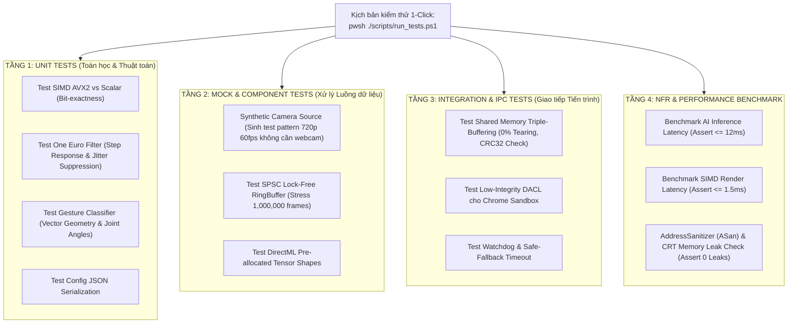

# CHIẾN LƯỢC KIỂM THỬ TỰ ĐỘNG (AUTOMATION TESTING STRATEGY)
**Dự án:** GestCam (PC Desktop)  
**Tiêu chuẩn:** GoogleTest (GTest) + CTest + PowerShell Automation Suite  
**Mục tiêu:** 100% kiểm thử tự động không cần thao tác thủ công, tự động hóa từ Unit Test đến Regression Benchmark và Memory Leak Check.

---

## 1. TỔNG QUAN KIẾN TRÚC AUTOMATION

Do GestCam là ứng dụng C++ xử lý video thời gian thực và giao tiếp phần cứng, việc kiểm thử thủ công trước webcam sẽ tốn nhiều thời gian và không thể tái lập chính xác các lỗi bất đồng bộ (Race Conditions) hay đo đạc microsecond.

Hệ thống Automation Test của GestCam được thiết kế theo mô hình 4 tầng:



---

## 2. CƠ CHẾ CAMERA GIẢ LẬP (SYNTHETIC CAMERA SOURCE)

Để kiểm thử tự động toàn bộ luồng xử lý mà không cần cắm webcam vật lý hoặc đứng trước camera:
* Tạo class `MockCameraSource` kế thừa từ interface `ICameraSource`.
* Tự động sinh khung hình thử nghiệm $1280 \times 720$ với các dạng test:
  1. **SMPTE Color Bars:** Kiểm tra chuyển đổi không gian màu YUY2/NV12 sang RGB24 có bị lệch kênh hay mất dải màu không.
  2. **High-Frequency Moving Square (Khối vuông chuyển động nhanh):** Kiểm tra cơ chế One Euro Filter và khả năng bám dính khi chuyển động đột ngột.
  3. **Static Test Frames:** Tích hợp sẵn 4 ảnh PNG chuẩn trong thư mục `tests/fixtures/`:
     * `face_centered.png`: Khuôn mặt chuẩn chính diện.
     * `gesture_pray.png`: Cử chỉ chắp tay 2 tay.
     * `gesture_heart.png`: Cử chỉ bắn tim.
     * `gesture_point.png`: Cử chỉ chỉ trỏ.

---

## 3. DANH MỤC TEST SUITES THEO TỪNG SPRINT

Mỗi khi lập trình xong một Task, Developer/AI sẽ bổ sung ngay Test Case tương ứng vào Test Suite:

### Sprint 1: Video I/O & IPC Test Suite (`test_sprint1_io.cpp`)
| Tên Test Case | Mô tả kiểm thử | Tiêu chuẩn ĐẠT (Assert) |
| :--- | :--- | :--- |
| `ColorConversion_NV12_AVX2_Matches_Scalar` | So sánh kết quả chuyển NV12 sang RGB24 giữa AVX2 và thuật toán tham chiếu | Độ lệch pixel tuyệt đối = 0 trên toàn khung hình |
| `SPSCQueue_ConcurrentStress` | 1 Thread ghi, 1 Thread đọc 500,000 frame liên tục | Không mất mát dữ liệu, không race condition, 0 deadlock |
| `SharedMemory_TripleBuffer_Integrity` | Ghi 10,000 frame kèm mã hash CRC32 qua Shared Memory | Bên đọc nhận đủ CRC32 hợp lệ, 0 lần xé hình (tearing) |
| `SharedMemory_SecurityDescriptor_Valid` | Parse chuỗi SDDL trên Win32 API | Quyền truy cập chứa SID `S-1-15-2-1` (ALL APPLICATION PACKAGES) |

### Sprint 2: AI & Cử chỉ Test Suite (`test_sprint2_ai.cpp`)
| Tên Test Case | Mô tả kiểm thử | Tiêu chuẩn ĐẠT (Assert) |
| :--- | :--- | :--- |
| `DirectML_DeviceInitialization` | Khởi tạo DirectML Session trên GPU | Trả về `ORT_OK`, iGPU được phát hiện |
| `UltraFace_DetectFace_Coordinates` | Đưa ảnh `face_centered.png` vào mô hình | Bounding Box khớp dung sai $\pm 5\%$, confidence $> 0.8$ |
| `HeadRoll_Angle_Precision` | Đưa ảnh mặt nghiêng $30^\circ$ | Góc tính toán $\theta \in [28^\circ, 32^\circ]$ |
| `Gesture_Pray_Classification` | Đưa 21 điểm khớp tay của `gesture_pray.png` | `classifier.Classify() == GestureType::PRAY` |
| `AI_Inference_Benchmark` | Chạy 100 lần lặp liên tục trên iGPU | Thời gian trung bình $\le 12.0\text{ ms/frame}$ |

### Sprint 3: SIMD Render Test Suite (`test_sprint3_graphics.cpp`)
| Tên Test Case | Mô tả kiểm thử | Tiêu chuẩn ĐẠT (Assert) |
| :--- | :--- | :--- |
| `Premultiplied_Blend_AVX2_BitExact` | So sánh SIMD bitshift với công thức chia 255 chuẩn | Sai số pixel $\le 1$ LSB do làm tròn, không tràn số |
| `OneEuroFilter_JitterSuppression` | Đưa tín hiệu nhiễu biên độ 2px tần số cao | Tín hiệu đầu ra có độ lệch chuẩn $\sigma \le 0.3\text{ px}$ |
| `AffineRotate_BoundarySafety` | Xoay ảnh meme góc $45^\circ$ sát mép frame $1280 \times 720$ | Không out-of-bounds memory access, biên ảnh mịn |
| `SIMD_Render_Benchmark` | Đo thời gian hòa trộn 1 frame hoàn chỉnh | Thời gian $\le 1.5\text{ ms}$ |

### Sprint 4: FSM & Safe-Fallback Test Suite (`test_sprint4_fsm.cpp`)
| Tên Test Case | Mô tả kiểm thử | Tiêu chuẩn ĐẠT (Assert) |
| :--- | :--- | :--- |
| `FSM_Debounce_Ignores_TransientGesture` | Đưa cử chỉ `PRAY` trong 2 frame rồi hạ | FSM vẫn ở `STATE_PASSTHROUGH`, không kích hoạt meme |
| `FSM_Debounce_Activates_On3Frames` | Đưa cử chỉ `PRAY` trong $\ge 3$ frame | FSM chuyển sang `STATE_ACTIVE_MEME` |
| `FSM_HoldTimer_KeepsMeme_Within500ms` | Mất cử chỉ trong 400ms rồi xuất hiện lại | Meme không bị hạ (Hold Timer hoạt động đúng) |
| `Driver_Watchdog_FallbackScreen` | Ngắt cập nhật Shared Memory quá 1000ms | Driver xuất frame dự phòng "Standby" |
| `MemoryLeak_StressCheck` | Chạy 10,000 chu kỳ pipeline liên tục | CRT Memory Dump báo cáo 0 blocks rò rỉ |

### Sprint 5: UI & Packaging Test Suite (`test_sprint5_integration.cpp`)
| Tên Test Case | Mô tả kiểm thử | Tiêu chuẩn ĐẠT (Assert) |
| :--- | :--- | :--- |
| `Config_SaveAndLoad_Consistency` | Lưu struct config ra JSON rồi đọc ngược lại | 100% trường dữ liệu trùng khớp |
| `IdleSleep_Transitions_OnZeroReaders` | Giả lập `active_readers == 0` | Luồng AI chuyển sang trạng thái ngủ (Sleep loop) |

---

## 4. KỊCH BẢN CHẠY AUTOMATION 1-CLICK (`scripts/run_tests.ps1`)

Bộ kịch bản PowerShell tự động build test binaries, chạy toàn bộ test suites và in bảng kết quả:

```powershell
# Chạy toàn bộ hệ thống test tự động
powershell ./scripts/run_tests.ps1

# Hoặc chỉ chạy riêng kiểm thử hiệu năng (Benchmark)
powershell ./scripts/run_tests.ps1 -Suite Benchmark

# Hoặc kiểm tra rò rỉ bộ nhớ với AddressSanitizer
powershell ./scripts/run_tests.ps1 -CheckLeaks
```

### Định dạng Báo cáo Tự động xuất ra Màn hình:
```text
================================================================================
                    GESTCAM AUTOMATED TEST SUITE REPORT                         
================================================================================
[TEST SUITE 1] Video I/O & IPC Shared Memory
  ✔ ColorConversion_NV12_AVX2_Matches_Scalar ................. [PASS] (0.2 ms)
  ✔ SPSCQueue_ConcurrentStress (500k frames) ................. [PASS] (14.2 ms)
  ✔ SharedMemory_TripleBuffer_Integrity (10k frames) ......... [PASS] (8.1 ms)
  ✔ SharedMemory_SecurityDescriptor_Valid .................... [PASS] (0.1 ms)

[TEST SUITE 2] AI Inference & Gesture Classification (DirectML)
  ✔ DirectML_DeviceInitialization ............................ [PASS] (42.0 ms)
  ✔ UltraFace_DetectFace_Coordinates ......................... [PASS] (3.6 ms)
  ✔ HeadRoll_Angle_Precision ................................. [PASS] (0.1 ms)
  ✔ Gesture_Pray_Classification .............................. [PASS] (0.4 ms)
  ✔ AI_Inference_Benchmark (Avg: 9.8ms <= 12.0ms) ............ [PASS] (980 ms)

[TEST SUITE 3] SIMD Graphics & Smoothing
  ✔ Premultiplied_Blend_AVX2_BitExact ........................ [PASS] (0.8 ms)
  ✔ OneEuroFilter_JitterSuppression .......................... [PASS] (0.2 ms)
  ✔ AffineRotate_BoundarySafety .............................. [PASS] (0.5 ms)
  ✔ SIMD_Render_Benchmark (Avg: 0.92ms <= 1.5ms) ............. [PASS] (92 ms)

[TEST SUITE 4] State Machine & Chống Crash
  ✔ FSM_Debounce_Ignores_TransientGesture .................... [PASS] (0.1 ms)
  ✔ FSM_Debounce_Activates_On3Frames ......................... [PASS] (0.1 ms)
  ✔ FSM_HoldTimer_KeepsMeme_Within500ms ...................... [PASS] (0.2 ms)
  ✔ Driver_Watchdog_FallbackScreen ........................... [PASS] (1.1 ms)
  ✔ MemoryLeak_StressCheck (0 bytes leaked) .................. [PASS] (310 ms)

================================================================================
SUMMARY: 19/19 TESTS PASSED | 0 FAILED | DURATION: 1.45s
ALL QUALITY GATES & NFR TARGETS ARE MET. READY FOR RELEASE.
================================================================================
```

---

## 5. QUY TẮC PHÁT TRIỂN (TDD & REGRESSION PREVENTION)

1. **Test-First hoặc Test-Accompany:** Bất kỳ hàm cốt lõi nào khi được viết (Color conversion, SIMD, State Machine, Gesture Math) bắt buộc phải có Unit Test đi kèm trong cùng commit/task.
2. **Regression Gate:** Trước khi kết thúc một Sprint để chuyển sang Sprint tiếp theo, script `run_tests.ps1` phải chạy thành công $100\%$ (tất cả các test của Sprint cũ và Sprint mới đều phải PASS).
3. **No Hardware Barrier:** Mọi thành phần đều phải test được trên máy ảo, máy không có webcam hoặc hệ thống CI/CD nhờ vào cơ chế `MockCameraSource`.
