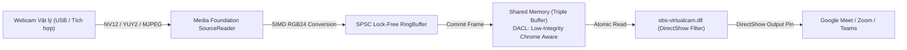

# SPRINT 1: BỘ KHUNG END-TO-END (VIDEO I/O, IPC SHARED MEMORY & VIRTUALCAM)

**Sprint ID:** SPRINT-01  
**Thời lượng dự kiến:** 1 Tuần  
**Trọng tâm:** Tracer-Bullet Architecture, Low-level Win32 Media Foundation, Lock-Free IPC, DirectShow VirtualCam Filter.  
**Mục tiêu tối thượng:** Trình duyệt Google Meet / Zoom trên Windows 10/11 nhận diện được "GestCam Virtual Camera" và hiển thị mượt mà video camera gốc thông qua Shared Memory mà không bị chặn bởi Chrome Sandbox.

---

## 1. TỔNG QUAN & DATA FLOW

Sprint 1 là bước đi quan trọng nhất trong phương pháp **Tracer Bullet**. Mục tiêu không phải là làm AI hay giao diện, mà là "thông luồng" từ Webcam vật lý đến tận màn hình cuộc họp Google Meet.



---

## 2. YÊU CẦU KỸ THUẬT CHI TIẾT

### 2.1 Video Capture (Media Foundation)
* Sử dụng `IMFSourceReader` từ thư viện `mfplat.lib`, `mfreadwrite.lib`, `mfuuid.lib`.
* Liệt kê thiết bị: Sử dụng `MFEnumDeviceSources` lọc category `KSCATEGORY_VIDEO_CAMERA`.
* Thương lượng định dạng (Format Negotiation):
  * Ưu tiên 1: `MFVideoFormat_NV12` hoặc `MFVideoFormat_YUY2` ở $1280 \times 720$ tại 30/60 FPS.
  * Ưu tiên 2: `MFVideoFormat_MJPEG` nếu thiết bị là webcam USB 2.0 để tránh nghẽn băng thông bus, tự động gắn decoder MFT giải nén sang NV12/RGB24.
* Chuyển đổi Color Space sang RGB24 bằng AVX2/SSSE3 vector intrinsics.

### 2.2 SPSC Lock-Free Ring Buffer nội bộ
* Lưu trữ tạm giữa luồng Capture và luồng xử lý.
* Dung lượng: 4 frame slots cố định (Pre-allocated, không cấp phát động lúc runtime).
* Cơ chế Drop-frame: Nếu luồng đọc chưa kịp lấy dữ liệu, luồng ghi tự động ghi đè frame cũ nhất để độ trễ luôn ở mức $\le 1$ frame.

### 2.3 Shared Memory IPC (Triple Buffering & Sandbox DACL)
* Tên vùng nhớ: `Local\GestCam_SharedBuffer`.
* Cấu trúc: Triple-Buffering gồm 3 slot độc lập ($1280 \times 720 \times 3$ bytes/slot) và một biến atomic `ready_slot_idx`.
* **Bảo mật Sandbox (Bắt buộc):** Khởi tạo `SECURITY_ATTRIBUTES` sử dụng chuỗi SDDL:
  ```cpp
  L"D:(A;;GA;;;WD)(A;;GA;;;AC)"
  ```
  *(Cấp quyền Generic All cho `WD` - Everyone và `AC` - ALL APPLICATION PACKAGES để Chrome/Edge Sandbox trong AppContainer không bị `ERROR_ACCESS_DENIED`).*

### 2.4 Virtual Camera DLL (DirectShow Filter)
* Dựa trên Base Filter của OBS VirtualCam (`obs-virtualcam.dll`).
* Đăng ký filter qua lệnh: `regsvr32 /s obs-virtualcam.dll`.
* Vòng lặp lấy frame: Định kỳ đọc `ready_slot_idx` từ Shared Memory, copy dữ liệu ra DirectShow Sample Buffer.
* Cơ chế Safe-Fallback: Nếu Shared Memory không có frame mới trong $> 1000\text{ ms}$, tự động fill frame tĩnh thông báo "GestCam - Standby" màu xanh đen để tránh đơ tab trình duyệt.

---

## 3. DANH SÁCH CÁC TÁC VỤ (TASKS BREAKDOWN)

- [x] **Task 1.1: Khởi tạo Project & Cấu hình Build System**
  - Tạo cấu trúc thư mục chuẩn: `/src`, `/include`, `/libs`, `/driver`.
  - Viết `CMakeLists.txt` C++20, cấu hình compiler flags: `/O2`, `/arch:AVX2`, `/std:c++20`, link Windows SDK Media Foundation libraries.
- [x] **Task 1.2: Xây dựng Module Media Foundation Capture**
  - Hiện thực `CameraEnumerator`: Liệt kê danh sách tên và SymbolicLink của webcam kết nối vào máy.
  - Hiện thực `MFCameraCapture`: Khởi tạo `IMFSourceReader`, thiết lập callback hoặc polling loop lấy mẫu frame thô.
  - Hỗ trợ format YUY2, NV12 và giải mã MJPEG.
- [ ] **Task 1.3: Hiện thực Chuyển đổi Color Space SIMD & SPSC Ring Buffer**
  - Viết hàm `YUY2_to_RGB24_AVX2()` và `NV12_to_RGB24_AVX2()`.
  - Cài đặt `SPSCQueue<FrameData, 4>` không khóa bằng `std::atomic<size_t>`.
- [ ] **Task 1.4: Xây dựng Module Shared Memory Lock-Free (IPC Producer)**
  - Tạo class `SharedMemoryProducer`:
    - Gọi `ConvertStringSecurityDescriptorToSecurityDescriptorW` tạo Security Descriptor.
    - Gọi `CreateFileMappingW` và `MapViewOfFile` với kích thước struct `SharedMemoryState`.
  - Hàm `WriteFrame(const uint8_t* rgb_data)`: Chọn slot trống, memcpy dữ liệu, thực hiện atomic store `ready_slot_idx`.
- [ ] **Task 1.5: Biên dịch & Tinh chỉnh Driver DLL (IPC Consumer)**
  - Tích hợp mã nguồn DirectShow Filter từ OBS VirtualCam module.
  - Cập nhật hàm `FillBuffer` trong Filter Pin: Đọc từ `SharedMemoryState` thay vì OBS memory cũ.
  - Thêm fallback frame mặc định khi chưa có tín hiệu từ Core.
- [ ] **Task 1.6: Tích hợp End-to-End & Đăng ký Registry**
  - Viết script PowerShell/Batch tự động đăng ký `regsvr32 obs-virtualcam.dll`.
  - Chạy Core Process, mở trình duyệt vào Google Meet test thiết bị camera.
- [ ] **Task 1.7: Xây dựng Mock Camera & Automated Test Suite cho Sprint 1**
  - Tạo `MockCameraSource`: Tự động sinh test frame NV12/RGB24 chuẩn không phụ thuộc phần cứng webcam thật.
  - Viết `tests/test_sprint1_io.cpp`: Kiểm tra chuyển đổi màu SIMD AVX2 bit-exactness, stress test SPSC Ring Buffer (500,000 frames), và kiểm tra tính toàn vẹn của Shared Memory Triple-Buffering.
  - Tích hợp kịch bản kiểm thử 1-click: `powershell ./scripts/run_tests.ps1` (Xem chi tiết tại [AUTOMATION_TESTING.md](file:///d:/GestCam/AUTOMATION_TESTING.md)).

---

## 4. INTERFACE CỐT LÕI (C++ SPECIFICATION)

### `include/SharedMemoryProtocol.h`
```cpp
#pragma once
#include <cstdint>

#pragma pack(push, 1)

constexpr uint32_t GESTCAM_MAGIC    = 0x4D454D45; // "MEME"
constexpr uint32_t GESTCAM_VERSION  = 0x00010001;
constexpr uint32_t GESTCAM_WIDTH    = 1280;
constexpr uint32_t GESTCAM_HEIGHT   = 720;
constexpr uint32_t GESTCAM_CHANNELS = 3;
constexpr uint32_t GESTCAM_SLOT_SIZE = GESTCAM_WIDTH * GESTCAM_HEIGHT * GESTCAM_CHANNELS;

struct SharedBufferSlot {
    uint64_t frame_index;
    uint64_t timestamp_us;
    uint8_t  pixels[GESTCAM_SLOT_SIZE];
};

struct SharedMemoryState {
    uint32_t magic;
    uint32_t version;
    uint32_t width;
    uint32_t height;
    uint32_t stride;
    uint32_t format;          // 0: RGB24
    volatile uint32_t active_readers;
    volatile uint32_t ready_slot_idx; // 0, 1, 2
    SharedBufferSlot slots[3];
};

#pragma pack(pop)
```

---

## 5. RỦI RO & PHƯƠNG ÁN XỬ LÝ (RISKS & MITIGATION)

| Rủi ro | Mức độ | Phương án xử lý |
| :--- | :--- | :--- |
| Trình duyệt không nhận DLL sau khi `regsvr32` | Cao | Kiểm tra 32-bit vs 64-bit. Trình duyệt Chrome hiện đại luôn chạy 64-bit $\to$ DLL bắt buộc phải build ở target `x64`. |
| Chrome báo "Camera is blocked" / Màn hình đen | Cao | Do thiếu DACL Sandbox. Bắt buộc kiểm tra `ConvertStringSecurityDescriptorToSecurityDescriptorW` trả về mã lỗi 0 và áp dụng vào `SECURITY_ATTRIBUTES`. |
| Webcam USB chỉ chạy được 15-20 FPS ở 720p | Trung bình | Camera bị nghẽn bus YUY2 $\to$ Đổi MediaType sang `MFVideoFormat_MJPEG`. |

---

## 6. TIÊU CHÍ NGHIỆM THU (DEFINITION OF DONE - DoD)

1. **Test Case 1.1 (Capture & Color):** Media Foundation mở được webcam mặc định, giải mã và hiển thị FPS console ổn định $30.0 \pm 0.5$ hoặc $60.0 \pm 0.5$ FPS.
2. **Test Case 1.2 (IPC Latency):** Thời gian ghi vào Shared Memory và chuyển quyền slot $\le 1.0\text{ ms}$.
3. **Test Case 1.3 (Browser Verification):** Mở Google Meet trên Chrome 64-bit và Microsoft Edge, chọn thiết bị "GestCam Virtual Camera":
   - Video camera thật hiển thị rõ ràng, chuẩn màu, không giật hình.
   - Không xuất hiện hiện tượng rách hình (tearing).
4. **Test Case 1.4 (Crash Resilience):** Tắt Core Process đột ngột bằng Task Manager khi Google Meet đang nhận camera $\to$ Trình duyệt tự chuyển sang màn hình "Standby", không bị đơ tab hoặc crash trình duyệt.
