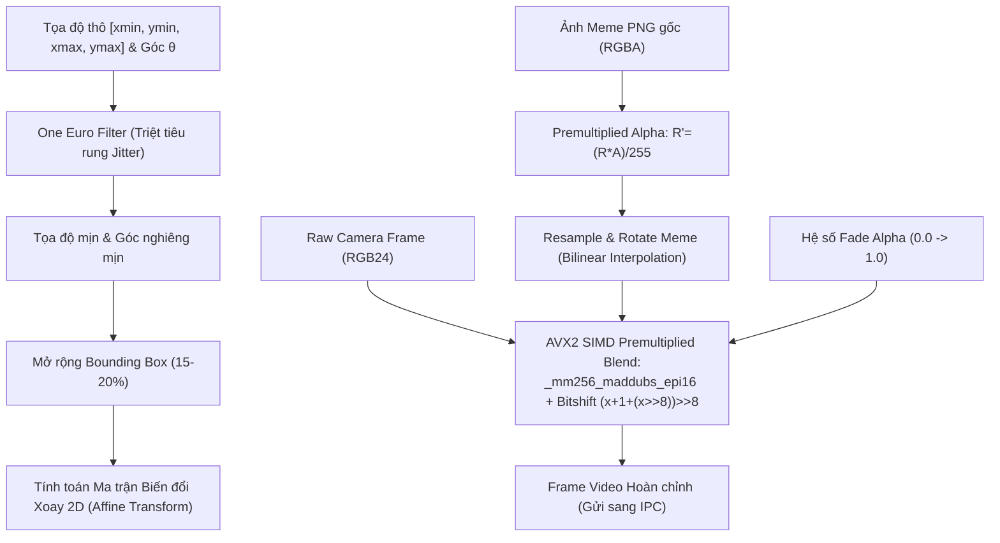

# SPRINT 3: ĐỒ HỌA SIMD, PREMULTIPLIED ALPHA BLENDING & XOAY MEME

**Sprint ID:** SPRINT-03  
**Thời lượng dự kiến:** 1 Tuần  
**Trọng tâm:** SIMD AVX2 Vectorization, Premultiplied Alpha Blending, Affine Matrix Rotation, One Euro Filter Jitter Smoothing, Smooth Fade Animation.  
**Mục tiêu tối thượng:** Hòa trộn ảnh meme PNG trong suốt lên khuôn mặt thật với thời gian render $\le 1.5\text{ ms/frame}$; meme tự động xoay nghiêng theo đầu và bám khít khuôn mặt mà không bị rung giật (jittering) pixel khi người dùng ngồi yên.

---

## 1. TỔNG QUAN & DATA PIPELINE

Sprint 3 chịu trách nhiệm biến tọa độ Bounding Box và góc nghiêng từ AI thành hình ảnh hoàn chỉnh được đè lên video camera trước khi gửi sang Shared Memory.



---

## 2. YÊU CẦU KỸ THUẬT CHI TIẾT

### 2.1 Quản lý Tài nguyên Ảnh Meme (`stb_image`)
* Sử dụng thư viện header-only `stb_image.h` nạp file PNG 32-bit (RGBA).
* Tiền xử lý sang **Premultiplied Alpha** ngay lúc nạp ảnh vào RAM:
  $$R' = \frac{R \times A}{255}, \quad G' = \frac{G \times A}{255}, \quad B' = \frac{B \times A}{255}$$
* Lưu trữ trong bộ nhớ đệm dạng texture tĩnh, giải phóng bộ nhớ cũ khi người dùng đổi ảnh meme.

### 2.2 Thuật toán Lọc nhiễu One Euro Filter (1€ Filter)
* **Vấn đề cần giải quyết:** Tọa độ bounding box từ mô hình AI luôn dao động $1 - 3$ pixel giữa các frame do nhiễu sensor camera, tạo cảm giác hình meme bị rung bần bật (jitter). Nếu dùng bộ lọc trung bình động đơn giản (Moving Average) thì khi quay đầu nhanh, meme sẽ bị trễ (lag) lại phía sau.
* **Giải pháp:** One Euro Filter sử dụng tần số cắt thích ứng (Adaptive Cutoff Frequency):
  * Khi tốc độ di chuyển chậm ($\dot{x} \approx 0$): Hạ tần số cắt xuống $f_c \to f_{c,\min}$ để lọc triệt để rung giật, cố định meme khi ngồi yên.
  * Khi tốc độ di chuyển nhanh ($\dot{x} \gg 0$): Tăng tần số cắt theo hệ số $\beta$ để giảm độ trễ xuống gần 0, meme bám dính tức thì theo đầu.
* Áp dụng độc lập cho 5 tham số: $x_{\text{center}}, y_{\text{center}}, \text{width}, \text{height}$ và góc xoay $\theta$.

### 2.3 Thuật toán Xoay & Co giãn Meme (Affine Transform)
* Tâm xoay: Trọng tâm Bounding Box khuôn mặt $(x_c, y_c)$.
* Ma trận biến đổi Affine 2D xoay theo góc $\theta$:
  $$\begin{bmatrix} x' \\ y' \end{bmatrix} = \begin{bmatrix} \cos\theta & -\sin\theta \\ \sin\theta & \cos\theta \end{bmatrix} \begin{bmatrix} x - x_c \\ y - y_c \end{bmatrix} + \begin{bmatrix} x_c \\ y_c \end{bmatrix}$$
* Sử dụng phép nội suy song tuyến tính (Bilinear Interpolation) để biên ảnh không bị răng cưa khi xoay góc nghiêng.

### 2.4 Hòa trộn SIMD AVX2 Tối ưu hóa cao độ
* Công thức hòa trộn Premultiplied Alpha thông thường:
  $$C_{\text{out}} = C_{\text{meme}} + C_{\text{camera}} \times \frac{255 - A_{\text{meme}}}{255}$$
* **Kỹ thuật tối ưu SIMD:**
  * Phép chia nguyên cho 255 trên CPU rất đắt đỏ.
  * Thay thế phép chia 255 bằng công thức xấp xỉ bitshift siêu nhanh (sai số 0 trên toàn dải byte $[0, 255]$):
    $$\frac{X}{255} \approx (X + 1 + (X \gg 8)) \gg 8$$
  * Nạp đồng thời 8 pixel RGB (24 bytes) vào thanh ghi 256-bit AVX2, xử lý song song trên các kênh màu bằng lệnh `_mm256_maddubs_epi16` và `_mm256_blendv_epi8`.

### 2.5 Hiệu ứng Chuyển cảnh (Fade-in / Fade-out)
* Khi cử chỉ được kích hoạt hoặc giải phóng, hệ số `alpha_factor` chuyển dần từ $0.0 \leftrightarrow 1.0$ trong thời gian $150\text{ ms}$ (khoảng 5-9 frames ở 60 FPS).
* Giúp việc xuất hiện của meme nhìn mượt mà, không bị hiện tượng "giật bắn" đột ngột trên màn hình cuộc gọi.

---

## 3. DANH SÁCH CÁC TÁC VỤ (TASKS BREAKDOWN)

- [ ] **Task 3.1: Tích hợp `stb_image` & Nạp Premultiplied Texture**
  - Đóng gói class `MemeTexture`: Quản lý buffer RGBA thô, chuyển đổi sang Premultiplied Alpha.
  - Hỗ trợ đổi ảnh động lúc runtime mà không gây rò rỉ bộ nhớ.
- [ ] **Task 3.2: Cài đặt Bộ lọc One Euro Filter (C++20)**
  - Viết class `OneEuroFilter` theo bài báo gốc của Géry Casiez.
  - Cung cấp các hàm tinh chỉnh tham số: `min_cutoff` (mặc định $1.0\text{ Hz}$), `beta` (mặc định $0.007$), `d_cutoff` ($1.0\text{ Hz}$).
- [ ] **Task 3.3: Xây dựng Module Xoay & Co giãn Affine (Image Warping)**
  - Viết hàm `TransformAndCropMeme`: Nhận góc $\theta$ và kích thước bounding box mở rộng, nội suy ra buffer tạm.
  - Tối ưu hóa bộ nhớ tạm: Dùng Fixed Scratch Buffer, không cấp phát heap trong render loop.
- [ ] **Task 3.4: Lập trình Hàm Alpha Blending AVX2 SIMD**
  - Viết kernel `Blend_Premultiplied_AVX2(uint8_t* bg_rgb24, const uint8_t* fg_rgba32, int w, int h, float global_alpha)`.
  - Cài đặt fallback kernel bằng code C++ thuần (Scalar) phòng trường hợp chạy trên CPU không hỗ trợ AVX2.
- [ ] **Task 3.5: Tích hợp Animation Fade & Đo kiểm Hiệu năng**
  - Cài đặt hàm Lerp chuyển đổi alpha: `current_alpha += delta_time / fade_duration`.
  - Viết benchmark test đo thời gian render toàn bộ 1 frame $1280 \times 720$.
- [ ] **Task 3.6: Xây dựng Automated Test Suite cho Đồ họa & SIMD (Sprint 3)**
  - Viết `tests/test_sprint3_graphics.cpp`:
    - So sánh đầu ra của AVX2 Premultiplied Blending với thuật toán Scalar chuẩn (Assert sai số $\le 1$ LSB).
    - Kiểm thử khả năng triệt tiêu nhiễu tần số cao của One Euro Filter ($\sigma \le 0.3\text{ px}$).
    - Tự động đo benchmark thời gian render (Assert $\le 1.5\text{ ms/frame}$).

---

## 4. INTERFACE CỐT LÕI (C++ SPECIFICATION)

### `include/OneEuroFilter.h`
```cpp
#pragma once
#include <cmath>

class LowPassFilter {
    float y = 0.0f, s = 0.0f;
    bool initialized = false;
public:
    float Filter(float val, float alpha) {
        if (!initialized) { y = s = val; initialized = true; return val; }
        y = val;
        s = alpha * val + (1.0f - alpha) * s;
        return s;
    }
};

class OneEuroFilter {
    float min_cutoff, beta, d_cutoff;
    LowPassFilter x_filt, dx_filt;
    float last_time = -1.0f;
public:
    OneEuroFilter(float min_cutoff = 1.0f, float beta = 0.007f, float d_cutoff = 1.0f)
        : min_cutoff(min_cutoff), beta(beta), d_cutoff(d_cutoff) {}

    float Filter(float value, float timestamp) {
        if (last_time < 0.0f) { last_time = timestamp; return x_filt.Filter(value, 1.0f); }
        float dt = timestamp - last_time;
        last_time = timestamp;
        if (dt <= 0.0f) dt = 1e-4f;
        
        float dx = (value - x_filt.Filter(value, 1.0f)) / dt;
        float edx = dx_filt.Filter(dx, Alpha(dt, d_cutoff));
        float cutoff = min_cutoff + beta * std::abs(edx);
        return x_filt.Filter(value, Alpha(dt, cutoff));
    }
private:
    float Alpha(float dt, float cutoff) {
        float tau = 1.0f / (2.0f * 3.14159265f * cutoff);
        return 1.0f / (1.0f + tau / dt);
    }
};
```

---

## 5. TIÊU CHÍ NGHIỆM THU (DEFINITION OF DONE - DoD)

1. **Test Case 3.1 (Render Speed):** Thời gian thực thi hàm hòa trộn SIMD AVX2 trên toàn bộ khung hình $1280 \times 720$ $\le 1.5\text{ ms/frame}$.
2. **Test Case 3.2 (Visual Stability / Jitter Test):** Người dùng ngồi yên trước camera trong 10 giây:
   - Viền ảnh meme không bị rung giật pixel.
   - Khoảng lệch tọa độ dao động $\le 0.5$ pixel nhờ One Euro Filter.
3. **Test Case 3.3 (Head Tilt Tracking):** Nghiêng đầu trái/phải liên tục:
   - Ảnh meme nghiêng góc chính xác theo độ nghiêng khuôn mặt.
   - Không xuất hiện hiện tượng biến dạng hoặc rách viền ảnh.
4. **Test Case 3.4 (Fade Transition):** Khi bật/tắt cử chỉ, meme mờ dần/hiện dần trong 150 ms mượt mà, không giật hình.
