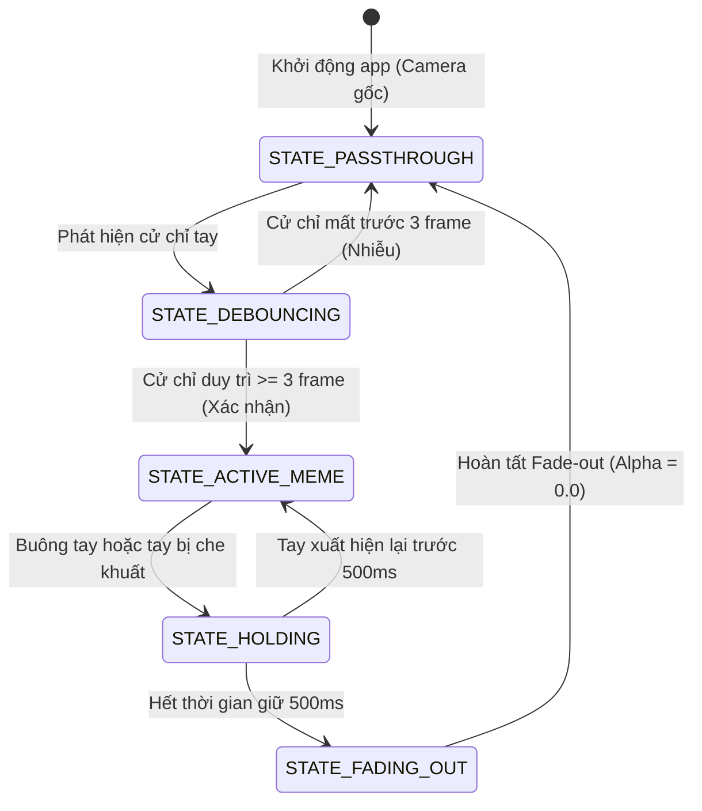

# SPRINT 4: MÁY TRẠNG THÁI CỬ CHỈ, PASSTHROUGH MODE & CHỐNG TREO

**Sprint ID:** SPRINT-04  
**Thời lượng dự kiến:** 1 Tuần  
**Trọng tâm:** Finite State Machine (FSM), Debounce Logic, Hold State Timer, Passthrough Mode, Safe-Fallback Driver Screen, Long-run Stress Testing & Memory Leak Verification.  
**Mục tiêu tối thượng:** Đảm bảo hệ thống vận hành ổn định tuyệt đối trong các cuộc gọi kéo dài nhiều giờ; chuyển đổi trạng thái cử chỉ thông minh, không nhấp nháy; đảm bảo Google Meet không bao giờ bị đơ lag khi ứng dụng chính tắt mở đột ngột.

---

## 1. TỔNG QUAN & FINITE STATE MACHINE (FSM)

Sprint 4 gắn kết toàn bộ các module riêng lẻ thành một trải nghiệm người dùng hoàn chỉnh. Máy trạng thái (FSM) đóng vai trò nhạc trưởng quyết định khi nào xuất video gốc và khi nào kích hoạt meme.



---

## 2. YÊU CẦU KỸ THUẬT CHI TIẾT

### 2.1 Cơ chế Chống nhiễu (Debounce - 3 Frames)
* **Vấn đề:** Trong quá trình giơ tay lên hoặc di chuyển tay tự nhiên, các khớp tay có thể tình cờ tạo thành góc giống cử chỉ mục tiêu trong 1–2 frame rồi mất đi, gây hiện tượng meme chớp nháy đột ngột (flickering).
* **Giải pháp:** Cử chỉ chỉ được chuyển sang trạng thái kích hoạt khi thuật toán AI nhận diện cùng một cử chỉ mục tiêu liên tục trong $\ge 3$ frame liên tiếp (khoảng $50 - 100\text{ ms}$).

### 2.2 Bộ đếm Giữ trạng thái (Hold State - 500 ms)
* **Vấn đề:** Khi người dùng đang chắp tay hoặc thả tim, nếu họ hơi hạ tay hoặc webcam bị mờ chuyển động (motion blur) trong 1–2 frame, AI có thể mất dấu tay tạm thời. Nếu tắt meme ngay lập tức sẽ làm hình ảnh bị giật cục.
* **Giải pháp:** Khi mất dấu cử chỉ, FSM chuyển sang `STATE_HOLDING` và khởi động bộ đếm thời gian $500\text{ ms}$.
  * Nếu cử chỉ xuất hiện lại trong $500\text{ ms}$: Giữ nguyên meme, reset bộ đếm.
  * Nếu sau $500\text{ ms}$ vẫn không thấy cử chỉ: Chuyển sang `STATE_FADING_OUT` để hạ dần meme về camera gốc.

### 2.3 Chế độ Passthrough Hiệu năng cao (Zero-Copy)
* Khi ở trạng thái `STATE_PASSTHROUGH` (người dùng không làm cử chỉ gì):
  * Frame camera thô được copy thẳng vào Shared Memory.
  * Bỏ qua hoàn toàn công đoạn resize, affine rotate và SIMD alpha blending, giúp giải phóng CPU/GPU tối đa khi người dùng đang tham gia cuộc họp bình thường.

### 2.4 Cơ chế An toàn Safe-Fallback của VirtualCam Driver
* Cài đặt bộ giám sát đồng hồ (Watchdog) trong `obs-virtualcam.dll`:
  * Nếu timestamp của Shared Memory không tăng trong $> 1000\text{ ms}$ (nghĩa là Core Process bị treo, bị Crash hoặc đang khởi động lại):
  * Filter DLL tự động xuất ra frame ảnh tĩnh lưu sẵn trong Resource DLL: Màn hình chờ chuyên nghiệp có logo "GestCam - Standby".
  * Nhờ vậy, cuộc gọi trên Google Meet / Zoom vẫn nhận được tín hiệu hình ảnh bình thường, hoàn toàn không bị đen màn hình hay đơ tab trình duyệt.

### 2.5 Kiểm thử Ổn định & Đo rò rỉ Bộ nhớ (Stress Testing)
* Bật AddressSanitizer (ASan) hoặc CRT Debug Heap trong MSVC: `_CrtSetDbgFlag(_CRTDBG_ALLOC_MEM_DF | _CRTDBG_LEAK_CHECK_DF)`.
* Chạy mô phỏng luồng video giả lập liên tục trong 4 đến 8 giờ để đảm bảo không rò rỉ con trỏ Direct3D, Media Foundation sample hoặc Shared Memory handle.

---

## 3. DANH SÁCH CÁC TÁC VỤ (TASKS BREAKDOWN)

- [ ] **Task 4.1: Xây dựng Lớp Quản lý Máy Trạng thái (GestureStateMachine)**
  - Cài đặt FSM chuyển đổi giữa các trạng thái: `PASSTHROUGH`, `DEBOUNCING`, `ACTIVE_MEME`, `HOLDING`, `FADING_OUT`.
  - Quản lý bộ đếm frame và đồng hồ thời gian thực (`std::chrono::steady_clock`).
- [ ] **Task 4.2: Tích hợp Logic Passthrough & Chuyển đổi Meme**
  - Đồng bộ FSM với `MemeRenderer` để điều khiển hệ số `global_alpha`.
  - Tự động chuyển đổi texture meme tương ứng khi người dùng đổi cử chỉ (từ `G_PRAY` sang `G_HEART`).
- [ ] **Task 4.3: Hoàn thiện Cơ chế Watchdog & Fallback Screen trong Driver DLL**
  - Nhúng ảnh tĩnh Standby vào resource của `obs-virtualcam.dll`.
  - Viết logic kiểm tra timeout timestamp trong hàm sinh frame của DirectShow Source Pin.
- [ ] **Task 4.4: Xử lý Đa người dùng & Đa khuôn mặt (Edge Cases)**
  - Nếu có nhiều khuôn mặt trong khung hình: Tự động khóa mục tiêu vào khuôn mặt có Bounding Box lớn nhất và gần tâm màn hình nhất.
  - Xử lý mượt mà khi người dùng di chuyển ra khỏi khung hình rồi quay lại.
- [ ] **Task 4.5: Stress Testing 4 Giờ & Đo kiểm Độ ổn định**
  - Chạy app liên tục 4 giờ với camera thật.
  - Dùng Windows Performance Monitor (PerfMon) ghi nhận biểu đồ RAM và CPU: Đảm bảo đường RAM là đường thẳng nằm ngang (không có slope dương - dấu hiệu memory leak).
- [ ] **Task 4.6: Xây dựng Automated Test Suite cho FSM & Bộ nhớ (Sprint 4)**
  - Viết `tests/test_sprint4_fsm.cpp`:
    - Kiểm thử tự động máy trạng thái: Debounce 3 frames kích hoạt meme, Hold State giữ meme trong 500ms, và trở về Passthrough khi buông tay.
    - Kiểm thử Watchdog timeout khi Core mất kết nối (Assert chuyển sang Fallback screen).
    - Tự động chạy CRT Debug Heap / ASan leak check (Assert 0 bytes leaked).

---

## 4. INTERFACE CỐT LÕI (C++ SPECIFICATION)

### `include/GestureStateMachine.h`
```cpp
#pragma once
#include <chrono>
#include "AiEngine.h"

enum class FsmState {
    PASSTHROUGH,
    DEBOUNCING,
    ACTIVE_MEME,
    HOLDING,
    FADING_OUT
};

class GestureStateMachine {
    FsmState current_state = FsmState::PASSTHROUGH;
    GestureType pending_gesture = GestureType::NONE;
    GestureType active_gesture = GestureType::NONE;
    
    int debounce_counter = 0;
    static constexpr int DEBOUNCE_THRESHOLD_FRAMES = 3;
    
    std::chrono::steady_clock::time_point hold_start_time;
    static constexpr int HOLD_DURATION_MS = 500;
    
    float alpha = 0.0f; // 0.0f (Passthrough) -> 1.0f (Full Meme)
public:
    void Update(GestureType raw_detected_gesture, float delta_time_sec);
    
    FsmState GetState() const { return current_state; }
    GestureType GetActiveGesture() const { return active_gesture; }
    float GetAlpha() const { return alpha; }
    bool ShouldRenderMeme() const { return alpha > 0.001f; }
};
```

---

## 5. TIÊU CHÍ NGHIỆM THU (DEFINITION OF DONE - DoD)

1. **Test Case 4.1 (Debounce Validation):** Cố tình vung tay nhanh tạo cử chỉ thoáng qua trong 1 frame $\to$ Meme không được kích hoạt, luồng video giữ nguyên camera gốc.
2. **Test Case 4.2 (Hold State Validation):** Đang chắp tay, hạ tay xuống trong $300\text{ ms}$ rồi giơ lại $\to$ Meme không bị chớp nháy hoặc biến mất.
3. **Test Case 4.3 (Fail-Safe Resilience):** Khi đang gọi video trong Google Meet:
   - Dùng Task Manager kill tiến trình `GestCam_Core.exe`.
   - Google Meet chuyển sang màn hình "GestCam - Standby" trong vòng $\le 1.0\text{ s}$, tab cuộc gọi không bị đơ, không bị ngắt kết nối.
4. **Test Case 4.4 (Memory Stability):** Sau 4 giờ chạy liên tục:
   - Mức chiếm dụng RAM chênh lệch không quá $\pm 2\text{ MB}$ so với lúc khởi động.
   - 0 lần crash, 0 lần rò rỉ bộ nhớ (kiểm tra qua Visual Studio Diagnostic Tools / CRT leak dump).
