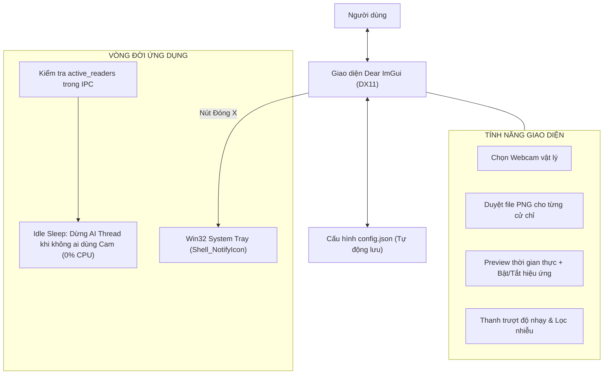

# SPRINT 5: GIAO DIỆN NGƯỜI DÙNG, SYSTEM TRAY & BỘ CÀI INNO SETUP

**Sprint ID:** SPRINT-05  
**Thời lượng dự kiến:** 1 Tuần  
**Trọng tâm:** Dear ImGui (DirectX 11 Backend), Win32 System Tray, Idle Sleep Power-Saving Logic, JSON Configuration Persistence, Inno Setup 6 Packaging Script.  
**Mục tiêu tối thượng:** Hoàn thiện sản phẩm thương mại hoàn chỉnh: Giao diện trực quan hiện đại, chạy ngầm khay hệ thống với mức tiêu thụ 0% CPU khi nhàn rỗi, bộ cài đặt One-Click tự động hóa đăng ký Driver DLL với dung lượng $\le 30\text{ MB}$.

---

## 1. TỔNG QUAN & KIẾN TRÚC GIAO DIỆN

Sprint 5 khoác lên GestCam một lớp áo hoàn thiện. Giao diện người dùng được thiết kế bằng **Dear ImGui** trên nền **DirectX 11**, cho phép hiển thị preview hình ảnh mượt mà mà chỉ chiếm dụng thêm $< 20\text{ MB}$ RAM.



---

## 2. YÊU CẦU KỸ THUẬT CHI TIẾT

### 2.1 Giao diện Dear ImGui (DirectX 11 Backend)
* Sử dụng **Dear ImGui** bản Docking/Standard kèm backend `imgui_impl_win32.cpp` và `imgui_impl_dx11.cpp`.
* Tạo cửa sổ Win32 không viền hoặc viền hiện đại (Dark Theme), kích thước chuẩn $800 \times 550$ pixel.
* Hiển thị Preview: Chuyển đổi frame RGB24 sang `ID3D11Texture2D` thông qua `D3D11_USAGE_DYNAMIC` và `UpdateSubresource` để render trực tiếp trong ImGui với tốc độ 60 FPS.

### 2.2 Các tính năng điều khiển
1. **Device Selector:** Dropdown liệt kê toàn bộ webcam tìm thấy từ Media Foundation, cho phép đổi camera trực tiếp mà không cần khởi động lại app.
2. **Meme File Browser:** Hỗ trợ xem thumbnail và chọn file ảnh PNG cho 3 hành động:
   * Chắp tay (`G_PRAY`)
   * Bắn tim (`G_HEART`)
   * Chỉ trỏ (`G_POINT`)
3. **Hiệu chỉnh Tham số:**
   * Ngưỡng tin cậy nhận diện (Confidence Slider: 50% – 95%).
   * Hệ số mượt mà One Euro Filter (`min_cutoff`, `beta`).
4. **Master Toggle:** Phím tắt hoặc nút bấm trên UI để Bật/Tắt tức thì toàn bộ hiệu ứng meme (đưa về camera thường).

### 2.3 Khay hệ thống (System Tray) & Chế độ Ngủ (Idle Sleep)
* **Thu nhỏ xuống khay hệ thống:** Khi bấm nút Đóng `[X]`, ứng dụng không thoát mà ẩn cửa sổ chính và tạo icon trên Taskbar Notification Area (`Shell_NotifyIconW`). Click chuột phải mở menu context: `Mở giao diện`, `Tạm dừng hiệu ứng`, `Thoát`.
* **Tiết kiệm điện năng triệt để (Idle Sleep):**
  * VirtualCam DLL khi được Chrome/Meet kết nối sẽ tăng biến `active_readers++` trong Shared Memory. Khi ngắt cuộc gọi sẽ giảm `active_readers--`.
  * Nếu `active_readers == 0` và cửa sổ UI đang thu nhỏ xuống khay: Core Process tự động ngắt luồng AI và đưa chu kỳ kiểm tra về `Sleep(100ms)`. **Mức chiếm dụng CPU tụt về đúng 0%**.

### 2.4 Quản lý Cấu hình (`config.json`)
* Lưu trữ các thiết lập của người dùng:
  * Camera SymbolicLink được chọn lần cuối.
  * Đường dẫn tuyệt đối tới các file ảnh meme.
  * Tham số nhạy AI và One Euro Filter.
* Tự động lưu khi người dùng thay đổi trên UI, tự động nạp lại khi ứng dụng khởi động.

### 2.5 Đóng gói Bộ cài đặt Inno Setup
* Tạo kịch bản đóng gói `setup.iss` sử dụng **Inno Setup 6**:
  * Tích hợp toàn bộ runtime: file chạy `GestCam.exe`, các DLL (`onnxruntime.dll`, `DirectML.dll`, `obs-virtualcam.dll`), thư mục `models/` (INT8) và thư mục `memes/` mặc định.
  * **Tự động đăng ký Driver:** Trong phần `[Run]`, chạy ngầm lệnh:
    `regsvr32.exe /s "{app}\obs-virtualcam.dll"`
  * **Tự động dọn dẹp khi gỡ bỏ:** Trong phần `[UninstallRun]`, chạy ngầm:
    `regsvr32.exe /u /s "{app}\obs-virtualcam.dll"`
  * Nén toàn bộ bằng thuật toán **LZMA2/Ultra64**, đảm bảo file cài đặt hoàn chỉnh có dung lượng $\le 30\text{ MB}$.

---

## 3. DANH SÁCH CÁC TÁC VỤ (TASKS BREAKDOWN)

- [ ] **Task 5.1: Xây dựng Giao diện Điều khiển Dear ImGui**
  - Khởi tạo cửa sổ Win32 và D3D11 SwapChain.
  - Thiết kế Dark Theme hiện đại cho ImGui.
  - Viết texture loader cho khung hình Preview video.
- [ ] **Task 5.2: Tích hợp Quản lý Cấu hình JSON**
  - Sử dụng thư viện `nlohmann/json.hpp`.
  - Viết hàm `ConfigManager::Save(const std::string& path)` và `ConfigManager::Load(...)`.
- [ ] **Task 5.3: Cài đặt Win32 System Tray & Context Menu**
  - Đăng ký icon khay hệ thống với message `WM_TRAYICON`.
  - Cài đặt phản hồi chuột: Click đúp mở app, Click phải hiện menu popup `TrackPopupMenu`.
- [ ] **Task 5.4: Hiện thực Logic Tiết kiệm Điện Idle Sleep**
  - Đọc `active_readers` từ Shared Memory.
  - Tạm dừng (Pause/Resume) luồng Camera Capture và luồng AI khi không có consumer nào mở camera.
- [ ] **Task 5.5: Viết Kịch bản Inno Setup & Tạo Bộ Cài Hoàn Chỉnh**
  - Viết file script `installer/GestCam_Setup.iss`.
  - Thêm icon ứng dụng, license text (MIT), màn hình hướng dẫn.
  - Build thử file `.exe` cài đặt và kiểm tra trên máy ảo / máy sạch không có môi trường dev.
- [ ] **Task 5.6: Hoàn thiện Kịch bản Kiểm thử Tự động 1-Click Toàn diện**
  - Viết script `scripts/run_tests.ps1`: Tự động build và chạy lần lượt cả 5 Test Suites (`sprint1` đến `sprint5`).
  - Kiểm tra tự động serialize/deserialize `config.json` và chuyển đổi trạng thái Idle Sleep.
  - Tạo báo cáo tổng kết chất lượng (Quality Gate Report) trước khi đóng gói bộ cài đặt.

---

## 4. KỊCH BẢN ĐÓNG GÓI MẪU (INNO SETUP SCRIPT)

### `installer/GestCam_Setup.iss`
```pascal
[Setup]
AppName=GestCam
AppVersion=1.1.0
DefaultDirName={autopf}\GestCam
DefaultGroupName=GestCam
OutputDir=..\dist
OutputBaseFilename=GestCam_Setup_v1.1.0
Compression=lzma2/ultra64
SolidCompression=yes
ArchitecturesInstallIn64BitMode=x64
PrivilegesRequired=admin

[Files]
Source: "..\bin\Release\GestCam.exe"; DestDir: "{app}"; Flags: ignoreversion
Source: "..\bin\Release\*.dll"; DestDir: "{app}"; Flags: ignoreversion
Source: "..\models\*.onnx"; DestDir: "{app}\models"; Flags: ignoreversion
Source: "..\assets\memes\*"; DestDir: "{app}\memes"; Flags: ignoreversion

[Icons]
Name: "{group}\GestCam"; Filename: "{app}\GestCam.exe"
Name: "{autodesktop}\GestCam"; Filename: "{app}\GestCam.exe"

[Run]
; Tự động đăng ký VirtualCam DLL vào Windows Registry khi cài đặt
Filename: "regsvr32.exe"; Parameters: "/s ""{app}\obs-virtualcam.dll"""; Flags: runhidden

[UninstallRun]
; Tự động hủy đăng ký VirtualCam DLL khi gỡ ứng dụng
Filename: "regsvr32.exe"; Parameters: "/u /s ""{app}\obs-virtualcam.dll"""; Flags: runhidden
```

---

## 5. TIÊU CHÍ NGHIỆM THU (DEFINITION OF DONE - DoD)

1. **Test Case 5.1 (UI Footprint):** Khi mở giao diện Preview hiển thị camera 60 FPS, tổng mức tiêu thụ RAM của toàn bộ ứng dụng $\le 70\text{ MB}$.
2. **Test Case 5.2 (Idle Power Consumption):** Thu nhỏ ứng dụng xuống khay hệ thống và tắt Google Meet:
   - Tải CPU đo bằng Task Manager tụt về đúng $0.0\%$.
   - Mức tiêu thụ GPU tụt về $0\%$.
3. **Test Case 5.3 (One-Click Installation):**
   - Chạy file `GestCam_Setup_v1.1.0.exe` trên máy tính mới (chưa từng cài công cụ lập trình).
   - Quá trình cài đặt hoàn tất không báo lỗi thiếu DLL (nhờ static runtime hoặc kèm VC_redist).
   - Mở ngay trình duyệt Chrome, vào Google Meet đã thấy sẵn "GestCam Virtual Camera".
4. **Test Case 5.4 (Clean Uninstallation):**
   - Chạy Uninstaller từ Windows Settings $\to$ Toàn bộ file trong thư mục cài đặt được xóa sạch.
   - Trình duyệt Chrome không còn thấy "GestCam Virtual Camera" trong danh sách thiết bị.
